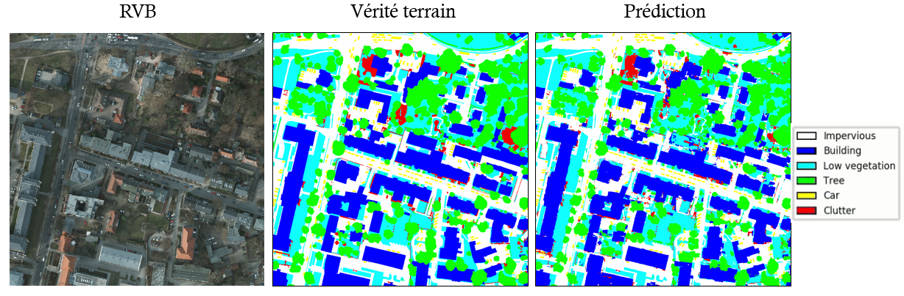
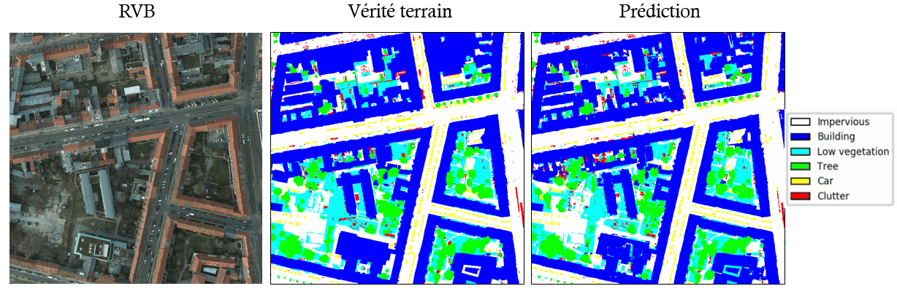

# DL_OSS_Comparison
Résultats des tests de Raster-Vision sur le jeu de données Potsdam.

## Organisation des tests
Test 1: Learning rate = 0.0001  
Test 2: Learning rate = 0.00001  
Test 3: Learning rate = 0.001  

## Résultats  

Les métriques globales, par classe et par tuile de validation se trouvent dans les fichiers .json, sous les dossiers eval.

Les tableaux suivants résuments les résultats:

Métriques globales, pour les 6 tuiles de Validation.  

|LR|Précision|Exactitude|f-score|
|--|--|--|--|
|0.00001   |0.88   |0.88   |0.88|
|0.0001   |0.90   |0.89   |0.89   |
|0.001   |0.90   |0.89   |0.89   |

Précision, sur l'ensemble des 6 tuiles de Validation.  

|LR|Voiture|Bâtiment|végétation basse|Arbre|Surface imperméable|Autre|
|--|--|--|--|--|--|--|
|0.00001|0.87   |0.95   |0.80   |0.84   |0.91   |0.38   |
|0.0001 |0.90   |0.96   |0.83   |0.86   |0.92   |0.41   |
|0.001  |0.90   |0.96   |0.82   |0.86   |0.92   |0.39   |

Exactitude, sur l'ensemble des 6 tuiles de Validation.  

|LR|Voiture|Bâtiment|végétation basse|Arbre|Surface imperméable|Autre|
|--|--|--|--|--|--|--|
|0.00001|0.90   |0.94   |0.87   |0.81   |0.89   |0.35   |
|0.0001 |0.91   |0.95   |0.88   |0.82   |0.90   |0.44   |
|0.001  |0.90   |0.94   |0.88   |0.82   |0.90   |0.45   |

f-score, sur l'ensemble des tuiles de Validation.

|LR|Voiture|Bâtiment|végétation basse|Arbre|Surface imperméable|Autre|
|--|--|--|--|--|--|--|
|0.00001|0.88   |0.94   |0.83   |0.82   |0.90   |0.36   |
|0.0001 |0.91   |0.95   |0.85   |0.84   |0.91   |0.41   |
|0.001  |0.90   |0.95   |0.85   |0.84   |0.91   |0.42   |

Résultats sur la tuile 3-12  

  
Résultats sur la tuile 6-12  

